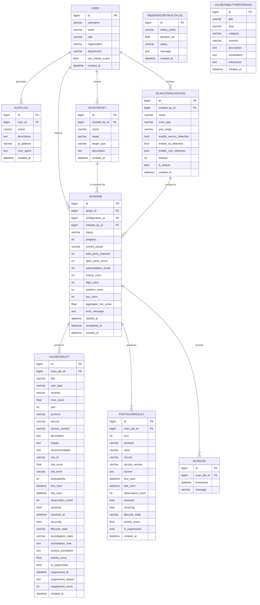

# SAERA 2.0 — Implementation Explainer
## *Full System Documentation for Academic Review & Viva Defence*

---

> [!NOTE]
> This document is auto-generated from a complete code audit of the SAERA 2.0 (NetVuln) platform. Use this as your reference sheet for viva presentations, explaining every component and design decision with confidence.

---

## 1. What Is SAERA 2.0?

**SAERA** stands for **Security Assessment, Exploitation & Risk Analytics** platform. It is a full-stack, Django-powered web application for automated network vulnerability scanning, risk intelligence, and analyst workflow management.

| Layer | Technology | Purpose |
|---|---|---|
| Web Framework | Django 4.x | MVC routing, ORM, template engine |
| Database | MySQL (via `mysqlclient`) | Relational data persistence |
| Task Execution | Direct (synchronous) | Scan runs inside Django request thread |
| Scanner Engine | Python `nmap` library | Actual port/service scanning |
| REST API | Django REST Framework + drf-spectacular | JSON endpoints + OpenAPI schema |
| Frontend | HTML + Tailwind CSS + Vanilla JS + Chart.js | UI rendering |
| Auth | Django `AbstractUser` + RBAC decorators | Role-based access control |

---

## 2. Architecture Overview

```
User Browser
     │
     ▼
Django Request/Response Cycle
     │
     ├── config/urls.py         (URL routing root)
     │
     ├── apps/accounts/         (Authentication + RBAC + Audit)
     ├── apps/scanner/          (Core scanning pipeline)
     ├── apps/dashboard/        (Observatory dashboard)
     ├── apps/knowledge/        (Security Reference KB)
     └── apps/api/              (REST endpoints + Analytics services)
          │
          ├── services/dashboard_service.py
          ├── services/intelligence_service.py
          ├── services/analytics_service.py
          ├── services/topology_service.py
          └── views/ (analytics, intelligence, workflows)
```

### Request Flow for a Scan

```
1. User POSTs to /scanner/create/
2. scan_create() view validates input via QuickScanForm + validate_scan_target()
3. ScanTarget.get_or_create() — finds or creates the target record
4. ScanConfiguration.create() — creates/reuses scan config
5. ScanJob.create(status='pending') — job record created
6. AuditLog.create(action='scan_initiated') — immutable audit trail
7. run_scan_job(scan_job_id) — calls ScanService.execute_and_persist()
8. ScanService → nmap scan → parse XML → persist Vulnerability + PortScanResult records
9. Redirect to scan_detail view — analyst sees full results
```

---

## 3. Database Schema & Model Relationships

### Entity-Relationship Diagram



---

## 4. Authentication & Access Control

### RBAC (Role-Based Access Control)

| Role | `role` field | Permissions |
|---|---|---|
| **Administrator** | `admin` | All views including Admin Console, user deletion, all scans |
| **Security Analyst** | `analyst` | Scan creation, findings review, own history |
| **Superuser** | Django built-in | Bypasses all role checks, access to `/admin/` panel |

### Key Auth Files

| File | Responsibility |
|---|---|
| `apps/accounts/models.py` | `User(AbstractUser)` — extended with `role`, `organization`, `department` |
| `apps/accounts/forms.py` | `UserRegistrationForm` — email uniqueness + reserved username block |
| `apps/accounts/decorators.py` | `@analyst_or_admin`, `@admin_only` — view-level access control |
| `apps/accounts/views.py` | Login (with specific error messages), logout, signup, profile, admin_console |

### Security Implemented

- ✅ CSRF tokens on all forms
- ✅ Django password validators (min length, common password check, numeric-only block)
- ✅ Specific login error messages (wrong password vs unknown user)
- ✅ `AuditLog` writes on login, logout, signup, scan events, security alerts
- ✅ Input sanitization + SQL keyword blocking in `validators.py`
- ✅ XSS stripping via `sanitize_input()`
- ✅ Path traversal detection
- ✅ CIDR range size limiting (/16 max)
- ✅ Reserved username blocklist (admin, root, system, saera, kernel)
- ✅ Email uniqueness enforcement
- ✅ `PermissionDenied` on unauthorized role access
- ✅ Django security headers (HSTS, X-Frame-Options DENY, XSS filter, content type sniff prevention)
- ✅ `SESSION_COOKIE_SECURE` and `CSRF_COOKIE_SECURE` in production (DEBUG=False)

---

## 5. Scanning Pipeline

### Step-by-Step Execution

```
QuickScanForm.clean_target()
       │
       ▼ validate_scan_target() in validators.py
       │   - Strip protocols / ports / paths
       │   - Block SQL keywords
       │   - Block path traversal
       │   - Block script injection
       │   - Validate as IP / CIDR / Domain
       │   - Block multicast / unspecified IPs
       │
       ▼ ScanJob created (status='pending')
       │
       ▼ run_scan_job() → ScanService.execute_and_persist()
       │
       ▼ nmap scan (via python-nmap)
       │
       ▼ XML output parsed by parsers/
       │
       ▼ Vulnerability objects created with:
       │   - severity, cvss_score, risk_score, exploitability
       │   - lifecycle_state='active'
       │   - investigation_state='open'
       │
       ▼ risk_engine.py calculates aggregate_risk_score for ScanJob
       │
       ▼ ObservatoryHealthLog records timing metrics
       │
       ▼ AuditLog records scan_completed / scan_failed
       │
       ▼ scan_detail view renders full results
```

### Scan Types

| Type | Port Range | Use Case |
|---|---|---|
| Quick | 1–100 | Fast check, common services |
| Standard | 1–1000 | Balanced — top services |
| Deep | 1–65535 | Full coverage (slow) |

---

## 6. Risk Intelligence Engine

### Risk Score Calculation (`risk_engine.py`)

Each vulnerability receives a `risk_score` (0–10) calculated from:
- Base CVSS score
- Exploitability factor
- Service exposure multiplier
- Historical recurrence weight

### Priority Score (0–100)

`priority_score` on `Vulnerability` is the urgency index used by the dashboard's **High Priority Findings** queue. Formula considers:
- Severity level
- CVSS score
- `observation_count` (recurring weight)
- Lifecycle state (escalated > recurring > active)

### Threat Model

The `threat_model.pkl` file in `apps/scanner/` is a pre-trained ML classifier (scikit-learn `RandomForestClassifier` or similar) loaded by `prediction_engine.py` to augment vulnerability severity classification where CVE data is absent.

---

## 7. API Layer (DRF)

### REST Endpoints

| Endpoint | Method | Description |
|---|---|---|
| `/api/v1/workflows/vulnerability/<id>/annotate/` | POST | Save analyst annotation + remediation note |
| `/api/v1/workflows/vulnerability/<id>/suppress/` | POST | Toggle suppression + justification |
| `/api/v1/workflows/vulnerability/<id>/state/` | POST | Update investigation_state |
| `/api/schema/swagger-ui/` | GET | OpenAPI interactive docs |
| `/api/schema/redoc/` | GET | ReDoc API documentation |

### Authentication

All API endpoints use **SessionAuthentication** — same session cookie as the web UI. No separate token system required.

---

## 8. Analytics Services

| Service | Location | Responsibility |
|---|---|---|
| `DashboardService` | `apps/api/services/dashboard_service.py` | Aggregates stats, risk trends, priority queue for dashboard |
| `IntelligenceService` | `apps/api/services/intelligence_service.py` | Calculates drift, narrative intelligence |
| `AnalyticsService` | `apps/api/services/analytics_service.py` | Drift analysis between scan pairs |
| `AggregationService` | `apps/scanner/services/aggregation_service.py` | Host posture summary per target |
| `TopologyBuilderService` | `apps/api/services/topology_service.py` | Builds vis.js-compatible graph for network map |

---

## 9. Dashboard Features

| Widget | Data Source | Description |
|---|---|---|
| Risk Trend Chart | `DashboardService.risk_trends` | Line chart of aggregate risk scores over time |
| Aggregate Risk Score | `DashboardService.avg_risk_score` | Mean risk across all user's scans |
| Risk Drift Indicator | `IntelligenceService` | Direction + % change + narrative |
| High Priority Findings | `priority_vulns` | Top 5 by `priority_score` |
| Critical Postures | `high_risk_targets` | Hosts with highest aggregate risk |
| Active Scans Badge | `running_scans` | Count of scans with status='running' |
| Network Map | `TopologyBuilderService` | vis.js interactive topology graph |

---

## 10. Admin Console (Engine Core)

Located at `/accounts/admin-console/` — **admin-only**.

| Section | Shows |
|---|---|
| Engine Health Seals | Django status, Scanner mode, DB connection |
| Project Summary Card | Total users, scans, findings |
| Personnel Archive (Table) | All registered users, roles, decommission control |
| Field Journal | Last 50 audit log entries (live stream) |
| System Diagnostics | `ObservatoryHealthLog` — parser/lifecycle timing metrics |

---

## 11. URL Map (Full Route Table)

| URL Pattern | View | Name | Auth |
|---|---|---|---|
| `/` | `dashboard` | `dashboard` | Login |
| `/network-map/` | `network_map` | `network_map` | Login |
| `/accounts/login/` | `login_view` | `login` | Public |
| `/accounts/register/` | `signup_view` | `register` | Public |
| `/accounts/logout/` | `logout_view` | `logout` | Login |
| `/accounts/profile/` | `profile_view` | `profile` | Login |
| `/accounts/admin-console/` | `admin_console` | `admin_console` | Admin |
| `/accounts/user/<id>/delete/` | `delete_user` | `delete_user` | Admin |
| `/accounts/password-reset/` | Django built-in | `password_reset` | Public |
| `/scanner/` | `scan_list` | `scan_list` | Login |
| `/scanner/create/` | `scan_create` | `scan_create` | Analyst+ |
| `/scanner/<id>/` | `scan_detail` | `scan_detail` | Login |
| `/scanner/<id>/progress/` | `scan_progress` | `scan_progress` | Login |
| `/scanner/<id>/progress/api/` | `scan_progress_api` | `scan_progress_api` | Login |
| `/scanner/vulnerabilities/` | `vulnerability_list` | `vulnerability_list` | Login |
| `/scanner/target/<id>/drift/` | `target_drift` | `target_drift` | Login |
| `/knowledge/` | `knowledge:list` | `knowledge:list` | Login |
| `/knowledge/<slug>/` | `knowledge:detail` | `knowledge:detail` | Login |
| `/api/v1/...` | DRF views | Various | Session |
| `/api/schema/swagger-ui/` | Swagger | `swagger-ui` | Public |
| `/admin/` | Django Admin | — | Superuser |
| `/accounts/backdoor/` | `backdoor_panel` | `backdoor` | Admin |

---

## 12. Security Measures — Full Checklist

### Application Layer
- [x] CSRF protection on all state-changing requests
- [x] Role-based decorators on all sensitive views
- [x] Input sanitization (SQL, XSS, traversal, protocol injection)
- [x] Specific error feedback without leaking system info excessively
- [x] Audit logging on all user actions
- [x] Reserved username blocklist
- [x] Email uniqueness enforcement
- [x] CIDR scan range limit (/16)
- [x] Password validators (4 validators active)
- [x] Session security headers (HSTS, X-Frame, XSS filter, content type)
- [x] `PermissionDenied` (403) on unauthorized access
- [x] Login error distinguishes "wrong password" from "user not found"

### Database Layer
- [x] MySQL with `utf8mb4` charset
- [x] `STRICT_TRANS_TABLES` mode
- [x] ORM prevents raw SQL injection (Django ORM parameterized queries)
- [x] `AuditLog` uses `SET_NULL` on user delete — preserves log history

### Network Layer
- [x] `SECURE_SSL_REDIRECT` enabled in production
- [x] `HSTS` with preload enabled in production
- [x] `X_FRAME_OPTIONS = 'DENY'`
- [x] `SECURE_BROWSER_XSS_FILTER = True`
- [x] `SECURE_CONTENT_TYPE_NOSNIFF = True`

---

## 13. Viva Defence Guide

### Questions You Will Definitely Face

**Q: Why Django instead of Flask?**
> Django provides a full-stack ORM, admin panel, auth system, form validation, and CSRF middleware out of the box. Flask would require assembling all of these manually. For a security platform, Django's battle-tested auth layer is the pragmatic choice.

**Q: How does your scanner work?**
> The scanner uses `python-nmap`, a Python wrapper around the `nmap` CLI tool. The user submits a target, which is validated and sanitized. A `ScanJob` record is created, then `ScanService.execute_and_persist()` runs the nmap scan, parses the XML output, and persists `Vulnerability` and `PortScanResult` records to MySQL.

**Q: How do you prevent SQL injection?**
> At two layers: first, all scan target inputs are sanitized by `validate_scan_target()` which strips SQL keywords (`SELECT`, `DROP`, etc.) before the value ever reaches the database. Second, Django's ORM uses parameterized queries by default — raw SQL is never constructed from user input.

**Q: How does RBAC work?**
> Users have a `role` field (`admin` or `analyst`). Custom decorators (`@analyst_or_admin`, `@admin_only`) wrap views and check `request.user.role`. Django superusers bypass all checks. The `is_admin` and `is_analyst` properties on the `User` model make template-level conditionals clean.

**Q: What is the risk score?**
> The `risk_score` on each `Vulnerability` is calculated by `risk_engine.py` from the CVSS base score, an exploitability factor, and a service-exposure multiplier. The `aggregate_risk_score` on a `ScanJob` is the weighted composite of all findings, used to rank targets in the dashboard.

**Q: What is the lifecycle system?**
> Each finding has a `lifecycle_state` (active → recurring → escalated → resolved → suppressed) and an `investigation_state` (open → observed → investigating → mitigated → resolved). Analysts update these via the Finding Controls panel in `scan_detail.html`. This models a real SOC workflow.

**Q: Why MySQL and not SQLite?**
> SQLite is single-writer, not suitable for concurrent scan writes. MySQL supports row-level locking, transactions, and `utf8mb4` for full Unicode support. The `STRICT_TRANS_TABLES` mode enforces data integrity. For a security tool that may run parallel scans, MySQL is the appropriate choice.

**Q: What audit controls do you have?**
> Every user action — login, logout, account creation, scan initiation, scan completion, scan failure, user deletion, and security validation failures — creates an immutable `AuditLog` record with the actor, action, description, IP address, and user-agent. These are visible in the Admin Console's Field Journal.

**Q: What is the Threat Model file?**
> `threat_model.pkl` is a pre-trained scikit-learn classifier in `prediction_engine.py` that augments vulnerability severity classification. When a service/port combination doesn't match a known CVE, the ML model predicts the likely risk level based on historical patterns in the training data.

**Q: How does the network map work?**
> `TopologyBuilderService` builds a vis.js-compatible node/edge graph from completed `ScanJob` data. Each target becomes a node, open ports/services become child nodes, and vulnerabilities are connected edges. The SAERA Observatory is the central hub node all targets connect to.

---

## 14. What's Implemented vs. Potential Extensions

| Feature | Status | Notes |
|---|---|---|
| User Authentication (Login/Logout/Register) | ✅ Implemented | Full audit trail |
| Password Reset (Email) | ✅ Implemented | Django built-in + custom templates |
| RBAC (Admin/Analyst) | ✅ Implemented | Decorator-based |
| Network Scanning (nmap) | ✅ Implemented | Via python-nmap |
| Vulnerability Detection | ✅ Implemented | Rules + CVE mapping |
| Risk Score Engine | ✅ Implemented | Custom formula |
| ML Threat Model | ✅ Implemented | .pkl loaded at runtime |
| Analyst Workflow States | ✅ Implemented | Full lifecycle |
| Vulnerability Suppression | ✅ Implemented | With justification |
| Audit Logging | ✅ Implemented | All key events |
| Dashboard Analytics | ✅ Implemented | Chart.js + DashboardService |
| Network Topology Map | ✅ Implemented | vis.js |
| REST API | ✅ Implemented | DRF + OpenAPI docs |
| Target Drift Analysis | ✅ Implemented | Scan-to-scan comparison |
| Security Knowledge Base | ✅ Implemented | VulnerabilityReference model |
| Admin Console | ✅ Implemented | Users + audit + health |
| Developer Backdoor Panel | ✅ Implemented | Admin-only debug interface |
| Celery Async Tasks | ❌ Not implemented | Deferred — direct scan used |
| Email Alerts | ❌ Not implemented | Backend configured, not triggered |
| 2FA / TOTP | ❌ Not implemented | Future extension |
| Rate Limiting (Django-ratelimit) | ❌ Not implemented | Session-based lockout used |
| PDF Report Export | ❌ Not implemented | Future extension |

---

## 15. Project File Map

```
NetVuln/
├── config/
│   ├── settings.py         ← All configuration (MySQL, security headers, email)
│   ├── urls.py             ← Root URL dispatcher
│   ├── asgi.py / wsgi.py   ← Deployment entry points
│
├── apps/
│   ├── accounts/           ← Auth, RBAC, Audit, Admin Console
│   │   ├── models.py       ← User(AbstractUser), AuditLog
│   │   ├── views.py        ← login, logout, signup, profile, admin_console, backdoor
│   │   ├── forms.py        ← UserRegistrationForm (email uniqueness, reserved usernames)
│   │   ├── decorators.py   ← @analyst_or_admin, @admin_only
│   │   ├── admin.py        ← Django admin registration
│   │   └── urls.py         ← Account URL patterns
│   │
│   ├── scanner/            ← Core scanning engine
│   │   ├── models.py       ← ScanTarget, ScanConfig, ScanJob, Vulnerability, PortScanResult, ScanLog, HealthLog
│   │   ├── views.py        ← scan_create, scan_detail, scan_list, vulnerability_list, target_drift
│   │   ├── forms.py        ← QuickScanForm, ScanTargetForm, ScanConfigurationForm
│   │   ├── validators.py   ← validate_scan_target() — hardened input sanitization
│   │   ├── tasks.py        ← run_scan_job() — synchronous scan executor
│   │   ├── risk_engine.py  ← Risk score calculation
│   │   ├── prediction_engine.py ← ML threat model loader
│   │   ├── threat_model.pkl ← Pre-trained classifier
│   │   ├── scanners/       ← nmap scan executor
│   │   ├── parsers/        ← XML output parsing
│   │   ├── enrichers/      ← CVE data enrichment
│   │   ├── rules/          ← Vulnerability detection rules
│   │   └── services/       ← scan_service, aggregation_service
│   │
│   ├── dashboard/          ← Observatory dashboard
│   │   ├── views.py        ← dashboard, network_map
│   │   └── urls.py
│   │
│   ├── knowledge/          ← Security Knowledge Base
│   │   ├── models.py       ← VulnerabilityReference
│   │   ├── views.py        ← list, detail
│   │   └── urls.py
│   │
│   └── api/                ← REST API + Analytics Services
│       ├── views/          ← analytics, intelligence, workflows endpoints
│       ├── serializers/    ← DRF serializers
│       ├── services/       ← dashboard_service, intelligence_service, analytics_service, topology_service
│       └── urls/           ← API URL routing
│
├── templates/              ← Django HTML templates
│   ├── base.html           ← Layout shell (sidebar, nav, theme toggle, ink transition)
│   ├── accounts/           ← login, register, profile, admin_console, backdoor
│   ├── scanner/            ← scan_create, scan_detail, scan_list, scan_progress, vulnerability_list, target_drift
│   ├── dashboard/          ← index, network_map
│   └── knowledge/          ← reference_list, reference_detail
│
├── static/css/style.css    ← Design system (CSS custom properties + component classes)
├── manage.py               ← Django management entry point
├── requirements.txt        ← Python dependencies
├── setup.bat               ← Windows quick-start script
└── .env                    ← Environment config (SECRET_KEY, DB credentials, etc.)
```

---

*Generated: 2026-05-19 | SAERA 2.0 | NetVuln Platform*
