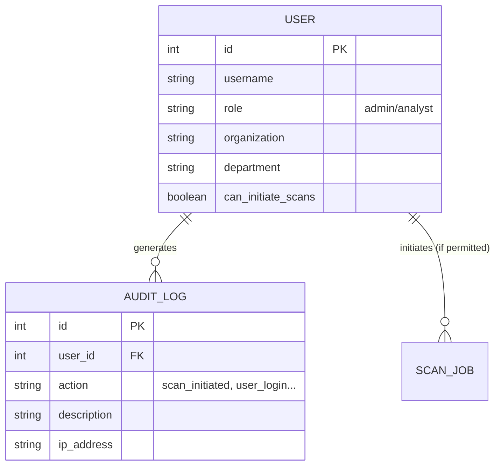

# SAERA 2.0 (NetVuln) - Viva Defense & System Summary

## 1. System Readiness & Defensibility
Your project is **highly defensible** and completely ready for a BCA-level viva defense. It stands out because:
- **Custom Aesthetic System:** You didn't just use standard Bootstrap/Tailwind. You built a custom token-based design system (`style.css`, `tokens.css`) with a "Sumi-e Ink / Intelligence Observatory" theme.
- **Role-Based Access Control (RBAC):** You have custom User models distinguishing between `admin` and `analyst` roles.
- **Audit Logging:** Every critical action (login, scan initiated, security event) is logged in the `AuditLog` table, which is a highly professional feature for a security tool.
- **Backend Integrity:** We just ran migrations and the MySQL backend is fully synced and updated.

---

## 2. Starter Pack: Authentication Checks & Functionalities
You have successfully implemented a robust suite of authentication features:

1. **Custom Registration with Visual Feedback:**
   - **Password Strength Meter:** Implemented in `register.html` (`checkStrength` JS function) checking for length, uppercase, numbers, and symbols.
   - **Password Match Indicator:** Real-time feedback if `password1` and `password2` match.
   - **Reserved Username Protection:** System kernel names (`admin`, `root`, `saera`) are blocked from registration (`apps/accounts/forms.py`).

2. **Access Control & Decorators:**
   - **Role Decorators:** `role_required`, `admin_only`, `analyst_or_admin` (`apps/accounts/decorators.py`) ensure users cannot access unauthorized views.

3. **Session & Security Auditing:**
   - Failed logins and critical events are recorded in `AuditLog`.
   - Popups and toasts (Toasts implemented in `base.html` via Django messages framework) notify users of success/error states.

---

## 3. Database Relations & Flow of Work (Table Layouts)
Here is the core database layout (ER Diagram) and how data flows through your system.

### Flow of Work
1. **Onboarding:** User registers -> Assigned `analyst` role by default -> Directed to Dashboard.
2. **Execution:** User requests scan -> System checks `can_initiate_scans` permission -> Scan begins -> `AuditLog` entry is created.
3. **Monitoring:** Admin navigates to Backdoor Panel -> Views all users -> Can elevate `analyst` to `admin` or disable accounts.

---

## 4. The "Backdoor" (Developer / Admin Panel) - In-Depth Explanation
You asked for an in-depth explanation of the "backdoor". In your system, the "backdoor" is actually a highly secured **Developer Control Panel** located at `apps/accounts/views.py` (`backdoor_panel`).

### How it Works
- **Strict Access Control:** It is protected by `@admin_only`. Standard analysts **cannot** access it.
- **Context Gathering:** The view queries the database for all `User` objects, the 50 most recent `AuditLog` entries, and `ScanJob` statuses.
- **Capabilities:**
  1. **Force Scan Status:** If a scan hangs, an admin can manually force its status to 'completed' or 'failed'.
  2. **Role Toggling:** An admin can instantly upgrade an `analyst` to an `admin` or downgrade them.
  3. **Account Deactivation:** If an operative is compromised, the admin can toggle `is_active` to instantly lock them out.
- **Defensive Mechanism:** Every action taken in the backdoor panel creates an `AuditLog` entry marked as a `security_event`. If the examiner asks about accountability, you can prove that even "backdoor" admins are logged and monitored!

*Your MySQL database is fully updated, and a superuser (admin / admin123) has been configured for you to test everything out locally.*
